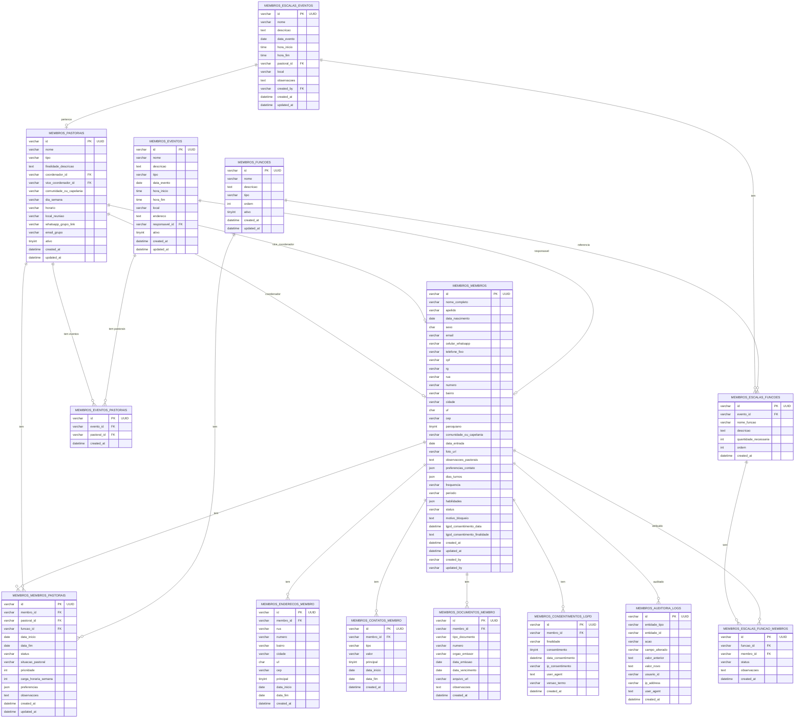

# 🗄️ Diagramas de Banco de Dados - Módulo Membros

**Versão:** 1.0  
**Banco:** gerencialparoq  
**Módulo:** Membros

---

## 📊 Diagrama ERD (Entidade-Relacionamento)



---

## 📋 Tabelas Principais

### 1. membros_membros

**Descrição:** Tabela principal de membros paroquiais.

**Campos Principais:**
- `id` (UUID, PK) - Identificador único
- `nome_completo` (VARCHAR, NOT NULL) - Nome completo
- `email` (VARCHAR, UNIQUE) - Email único
- `cpf` (VARCHAR, UNIQUE) - CPF único
- `status` (VARCHAR) - Status do membro (ativo, afastado, bloqueado, etc)
- Campos JSON: `preferencias_contato`, `dias_turnos`, `habilidades`

**Índices:**
- `idx_membros_nome` - Nome completo
- `idx_membros_email` - Email
- `idx_membros_cpf` - CPF
- `idx_membros_status` - Status

---

### 2. membros_pastorais

**Descrição:** Tabela de pastorais da paróquia.

**Campos Principais:**
- `id` (UUID, PK)
- `nome` (VARCHAR, NOT NULL)
- `tipo` (VARCHAR)
- `coordenador_id` (FK para membros_membros)
- `vice_coordenador_id` (FK para membros_membros)
- `ativo` (TINYINT)

**Relacionamentos:**
- 1:N com `membros_membros_pastorais`
- N:N com `membros_membros` via `membros_membros_pastorais`

---

### 3. membros_membros_pastorais

**Descrição:** Tabela de relacionamento N:N entre membros e pastorais.

**Campos Principais:**
- `id` (UUID, PK)
- `membro_id` (FK para membros_membros)
- `pastoral_id` (FK para membros_pastorais)
- `funcao_id` (FK para membros_funcoes)
- `data_inicio`, `data_fim`
- `status`, `situacao_pastoral`

**Índices:**
- `idx_membros_pastorais_pastoral` - Pastoral
- `idx_membros_pastorais_membro` - Membro
- `idx_membros_pastorais_funcao` - Função

---

### 4. membros_eventos

**Descrição:** Tabela de eventos da paróquia.

**Campos Principais:**
- `id` (UUID, PK)
- `nome` (VARCHAR)
- `tipo` (VARCHAR)
- `data_evento` (DATE)
- `hora_inicio`, `hora_fim` (TIME)
- `responsavel_id` (FK para membros_membros)

**Relacionamentos:**
- N:N com `membros_pastorais` via `membros_eventos_pastorais`

---

### 5. membros_escalas_eventos

**Descrição:** Escalas de eventos com funções e membros atribuídos.

**Campos Principais:**
- `id` (UUID, PK)
- `nome` (VARCHAR)
- `data_evento` (DATE)
- `pastoral_id` (FK para membros_pastorais)
- `created_by` (FK para membros_membros)

**Relacionamentos:**
- 1:N com `membros_escalas_funcoes`

---

### 6. membros_escalas_funcoes

**Descrição:** Funções dentro de uma escala de evento.

**Campos Principais:**
- `id` (UUID, PK)
- `evento_id` (FK para membros_escalas_eventos)
- `nome_funcao` (VARCHAR)
- `quantidade_necessaria` (INT)

**Relacionamentos:**
- 1:N com `membros_escalas_funcao_membros`

---

### 7. membros_escalas_funcao_membros

**Descrição:** Membros atribuídos a funções em escalas.

**Campos Principais:**
- `id` (UUID, PK)
- `funcao_id` (FK para membros_escalas_funcoes)
- `membro_id` (FK para membros_membros)
- `status` (VARCHAR)

---

## 🔗 Relacionamentos Principais

### Membro ↔ Pastoral (N:N)

```
membros_membros ←→ membros_membros_pastorais ←→ membros_pastorais
```

Um membro pode estar em múltiplas pastorais e uma pastoral pode ter múltiplos membros.

### Evento ↔ Pastoral (N:N)

```
membros_eventos ←→ membros_eventos_pastorais ←→ membros_pastorais
```

Um evento pode estar relacionado a múltiplas pastorais.

### Escala → Função → Membro

```
membros_escalas_eventos → membros_escalas_funcoes → membros_escalas_funcao_membros → membros_membros
```

Uma escala tem funções, e cada função pode ter múltiplos membros atribuídos.

---

## 📊 Diagrama de Relacionamentos Simplificado

```
MEMBROS_MEMBROS
    ├── MEMBROS_MEMBROS_PASTORAIS ──→ MEMBROS_PASTORAIS
    ├── MEMBROS_ENDERECOS_MEMBRO
    ├── MEMBROS_CONTATOS_MEMBRO
    ├── MEMBROS_DOCUMENTOS_MEMBRO
    ├── MEMBROS_CONSENTIMENTOS_LGPD
    └── MEMBROS_ESCALAS_FUNCAO_MEMBROS

MEMBROS_PASTORAIS
    ├── MEMBROS_MEMBROS_PASTORAIS ──→ MEMBROS_MEMBROS
    ├── MEMBROS_EVENTOS_PASTORAIS ──→ MEMBROS_EVENTOS
    └── MEMBROS_ESCALAS_EVENTOS

MEMBROS_EVENTOS
    ├── MEMBROS_EVENTOS_PASTORAIS ──→ MEMBROS_PASTORAIS
    └── MEMBROS_ESCALAS_EVENTOS

MEMBROS_ESCALAS_EVENTOS
    ├── MEMBROS_ESCALAS_FUNCOES
    │   └── MEMBROS_ESCALAS_FUNCAO_MEMBROS ──→ MEMBROS_MEMBROS
    └── MEMBROS_PASTORAIS
```

---

## 🔍 Índices e Performance

### Índices Principais

**membros_membros:**
- `idx_membros_nome` - Busca por nome
- `idx_membros_email` - Validação de email único
- `idx_membros_cpf` - Validação de CPF único
- `idx_membros_status` - Filtro por status
- `idx_membros_status_nome` - Composto (status + nome)

**membros_membros_pastorais:**
- `idx_membros_pastorais_pastoral` - Busca por pastoral
- `idx_membros_pastorais_membro` - Busca por membro
- `idx_membros_pastorais_funcao` - Busca por função

**membros_eventos:**
- `idx_eventos_data` - Busca por data
- `idx_eventos_data_ativo` - Composto (data + ativo)

---

## 📝 Observações Importantes

1. **UUIDs:** Todas as chaves primárias são UUIDs (VARCHAR(36))
2. **Soft Delete:** Exclusões são feitas alterando `status` para 'bloqueado'
3. **Auditoria:** Tabela `membros_auditoria_logs` registra todas as alterações
4. **LGPD:** Tabela `membros_consentimentos_lgpd` registra consentimentos
5. **Campos JSON:** Alguns campos são JSON (preferencias_contato, dias_turnos, habilidades)
6. **Timestamps:** Todas as tabelas principais têm `created_at` e `updated_at`

---

**Última atualização:** Janeiro 2025

