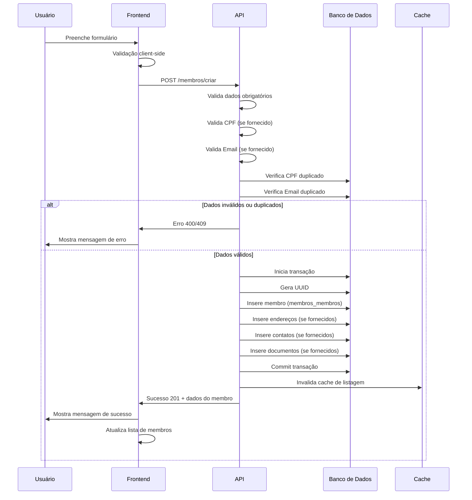
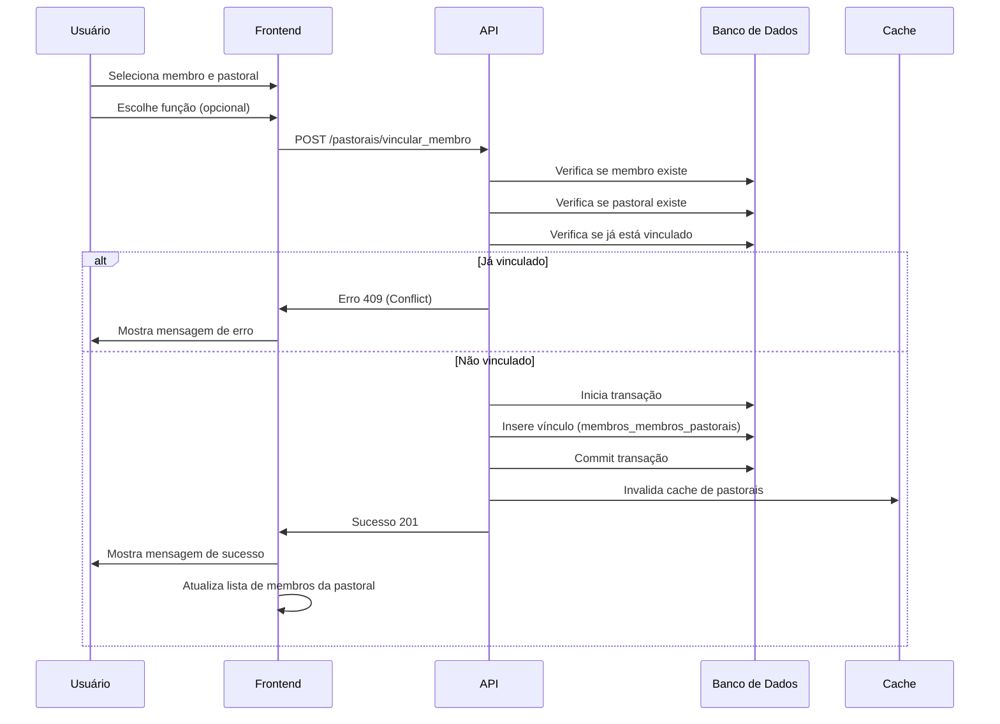
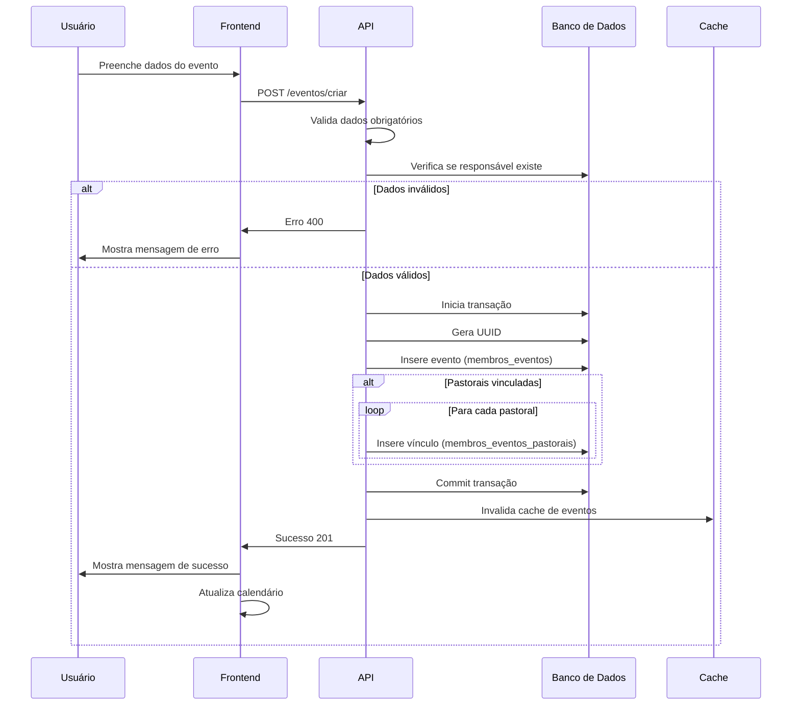
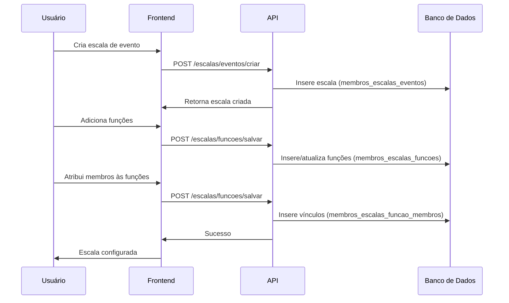
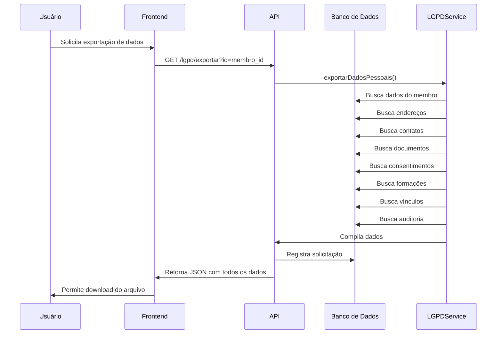
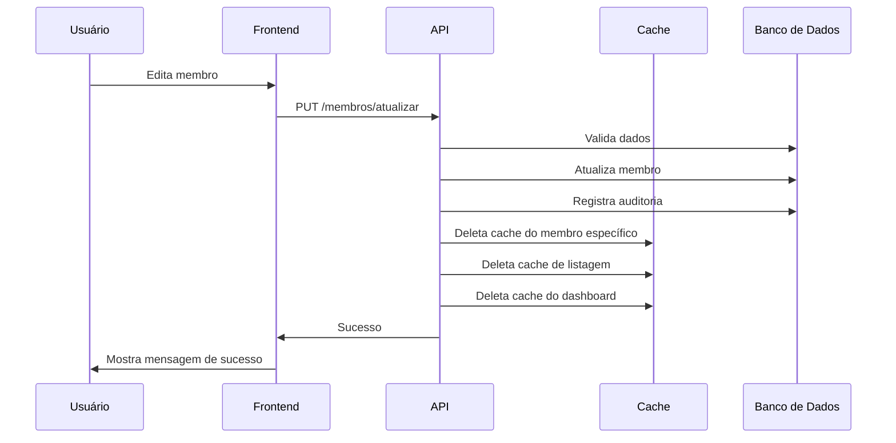
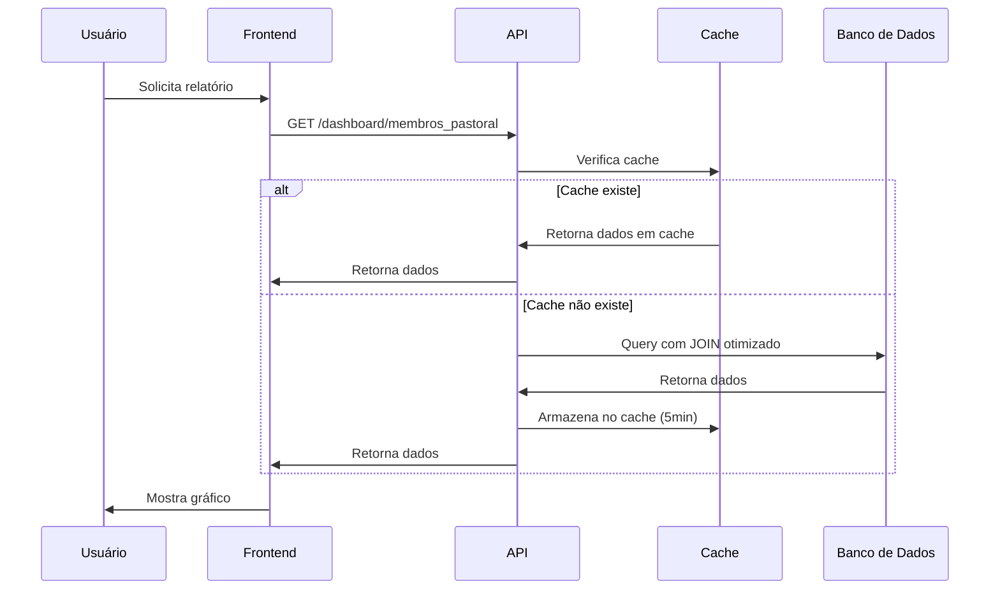
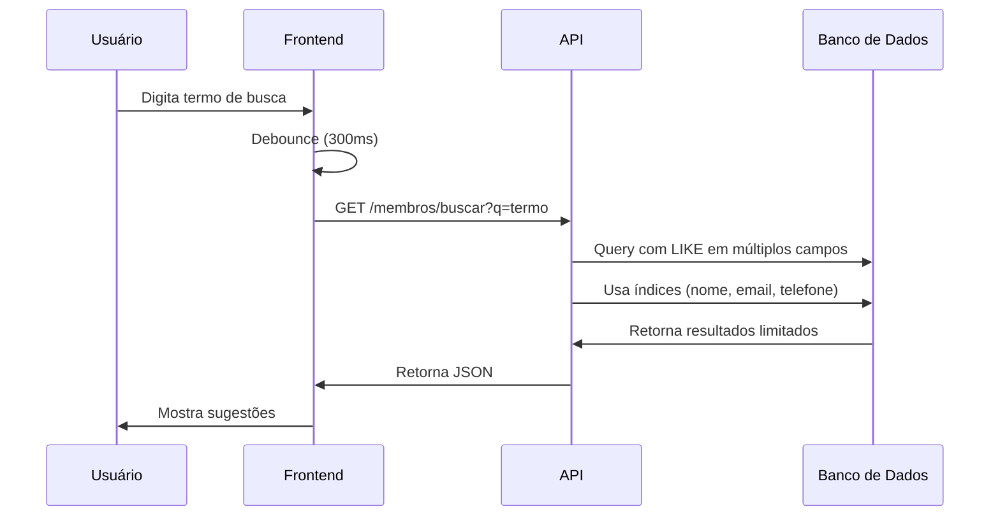

# 🔄 Fluxos de Trabalho - Módulo Membros

**Versão:** 1.0  
**Módulo:** Membros

---

## 📋 Índice

1. [Cadastro de Membro](#cadastro-de-membro)
2. [Vínculo Membro-Pastoral](#vínculo-membro-pastoral)
3. [Criação de Evento](#criação-de-evento)
4. [Sistema de Escalas](#sistema-de-escalas)
5. [Exportação de Dados LGPD](#exportação-de-dados-lgpd)

---

## 👤 Cadastro de Membro

### Fluxo Completo

### Etapas Detalhadas

1. **Preenchimento do Formulário**
   - Usuário preenche dados pessoais
   - Campos obrigatórios: `nome_completo`
   - Campos opcionais: todos os outros

2. **Validação Client-Side**
   - Validação de formato de email
   - Validação de CPF
   - Validação de campos obrigatórios

3. **Envio para API**
   - POST `/membros/criar`
   - Body em JSON

4. **Validação Server-Side**
   - Valida campos obrigatórios
   - Valida formato de email (se fornecido)
   - Valida formato de CPF (se fornecido)
   - Limpa CPF (remove pontos e traços)

5. **Verificação de Duplicatas**
   - Verifica se email já existe
   - Verifica se CPF já existe

6. **Criação no Banco**
   - Gera UUID para o membro
   - Inicia transação
   - Insere membro principal
   - Insere dados relacionados (endereços, contatos, documentos)
   - Commit transação

7. **Invalidação de Cache**
   - Limpa cache de listagem de membros
   - Limpa cache do dashboard

8. **Resposta**
   - Retorna dados do membro criado
   - Status 201 (Created)

---

## 🔗 Vínculo Membro-Pastoral

### Fluxo Completo

### Etapas Detalhadas

1. **Seleção**
   - Usuário seleciona membro
   - Usuário seleciona pastoral
   - Usuário escolhe função (opcional)

2. **Validação**
   - Verifica se membro existe
   - Verifica se pastoral existe
   - Verifica se já está vinculado

3. **Criação do Vínculo**
   - Insere registro em `membros_membros_pastorais`
   - Define `data_inicio` como data atual
   - Define `status` como 'ativo'

4. **Atualização**
   - Invalida cache de pastorais
   - Atualiza contadores

---

## 📅 Criação de Evento

### Fluxo Completo

### Etapas Detalhadas

1. **Preenchimento**
   - Nome do evento
   - Data e horários
   - Local
   - Responsável
   - Pastorais relacionadas (opcional)

2. **Validação**
   - Dados obrigatórios
   - Validação de datas
   - Verificação de responsável

3. **Criação**
   - Insere evento principal
   - Cria vínculos com pastorais (se houver)

4. **Atualização**
   - Invalida cache de eventos
   - Atualiza calendário

---

## 📋 Sistema de Escalas

### Fluxo Completo

### Etapas Detalhadas

1. **Criação da Escala**
   - Define data e horário
   - Seleciona pastoral
   - Define local

2. **Definição de Funções**
   - Adiciona funções necessárias
   - Define quantidade de membros por função

3. **Atribuição de Membros**
   - Seleciona membros para cada função
   - Pode ser feito por drag-and-drop no frontend

4. **Visualização**
   - Mostra escala completa
   - Possibilita exportação

---

## 🔒 Exportação de Dados LGPD

### Fluxo Completo

### Etapas Detalhadas

1. **Solicitação**
   - Usuário solicita exportação de dados pessoais
   - Sistema valida permissões

2. **Coleta de Dados**
   - Busca dados principais do membro
   - Busca dados relacionados (endereços, contatos, documentos)
   - Busca histórico (auditoria, consentimentos)

3. **Compilação**
   - Agrupa todos os dados
   - Formata em JSON estruturado
   - Adiciona metadados (data de exportação, solicitado por)

4. **Registro**
   - Registra solicitação na auditoria
   - Gera arquivo para download

5. **Entrega**
   - Disponibiliza arquivo para download
   - Arquivo em formato JSON ou PDF

---

## 🔄 Fluxo de Atualização com Cache

### Exemplo: Atualização de Membro

### Estratégia de Cache

- **Cache de Dados Individuais:** TTL curto (2-5 minutos)
- **Cache de Listagens:** TTL médio (5-10 minutos)
- **Cache de Dashboard:** TTL médio (5 minutos)
- **Invalidação:** Ao criar/atualizar/excluir, cache relacionado é invalidado

---

## 📊 Fluxo de Relatórios

### Exemplo: Relatório de Membros por Pastoral

---

## 🔍 Fluxo de Busca

### Busca de Membros

### Otimizações

- **Debounce:** Evita queries excessivas
- **Índices:** Usa índices em campos de busca
- **Limite:** Retorna máximo de 10 resultados
- **Campos:** Busca apenas campos essenciais

---

**Última atualização:** Janeiro 2025

