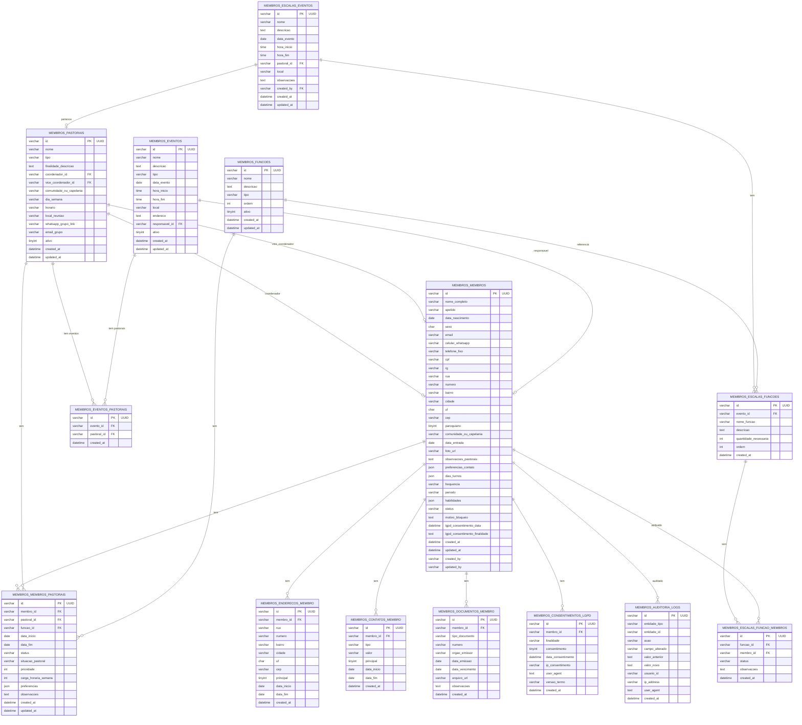

# 🗄️ Diagramas de Banco de Dados - Módulo Membros

**Vers√£o:** 1.0  
**Banco:** gerencialparoq  
**Módulo:** Membros

---

## üìä Diagrama ERD (Entidade-Relacionamento)


```mermaid
erDiagram
    MEMBROS_MEMBROS ||--o{ MEMBROS_MEMBROS_PASTORAIS : "tem"
    MEMBROS_PASTORAIS ||--o{ MEMBROS_MEMBROS_PASTORAIS : "tem"
    MEMBROS_PASTORAIS ||--o{ MEMBROS_EVENTOS_PASTORAIS : "tem eventos"
    MEMBROS_EVENTOS ||--o{ MEMBROS_EVENTOS_PASTORAIS : "tem pastorais"
    MEMBROS_MEMBROS ||--o{ MEMBROS_ENDERECOS_MEMBRO : "tem"
    MEMBROS_MEMBROS ||--o{ MEMBROS_CONTATOS_MEMBRO : "tem"
    MEMBROS_MEMBROS ||--o{ MEMBROS_DOCUMENTOS_MEMBRO : "tem"
    MEMBROS_MEMBROS ||--o{ MEMBROS_CONSENTIMENTOS_LGPD : "tem"
    MEMBROS_MEMBROS ||--o{ MEMBROS_AUDITORIA_LOGS : "auditado"
    MEMBROS_PASTORAIS ||--o| MEMBROS_MEMBROS : "coordenador"
    MEMBROS_PASTORAIS ||--o| MEMBROS_MEMBROS : "vice_coordenador"
    MEMBROS_EVENTOS ||--o| MEMBROS_MEMBROS : "responsavel"
    MEMBROS_ESCALAS_EVENTOS ||--o| MEMBROS_PASTORAIS : "pertence"
    MEMBROS_ESCALAS_EVENTOS ||--o{ MEMBROS_ESCALAS_FUNCOES : "tem"
    MEMBROS_ESCALAS_FUNCOES ||--o{ MEMBROS_ESCALAS_FUNCAO_MEMBROS : "tem"
    MEMBROS_MEMBROS ||--o{ MEMBROS_ESCALAS_FUNCAO_MEMBROS : "atribuido"
    MEMBROS_FUNCOES ||--o{ MEMBROS_MEMBROS_PASTORAIS : "tem"
    MEMBROS_FUNCOES ||--o{ MEMBROS_ESCALAS_FUNCOES : "referencia"

    MEMBROS_MEMBROS {
        varchar id PK "UUID"
        varchar nome_completo
        varchar apelido
        date data_nascimento
        char sexo
        varchar email
        varchar celular_whatsapp
        varchar telefone_fixo
        varchar cpf
        varchar rg
        varchar rua
        varchar numero
        varchar bairro
        varchar cidade
        char uf
        varchar cep
        tinyint paroquiano
        varchar comunidade_ou_capelania
        date data_entrada
        varchar foto_url
        text observacoes_pastorais
        json preferencias_contato
        json dias_turnos
        varchar frequencia
        varchar periodo
        json habilidades
        varchar status
        text motivo_bloqueio
        datetime lgpd_consentimento_data
        text lgpd_consentimento_finalidade
        datetime created_at
        datetime updated_at
        varchar created_by
        varchar updated_by
    }

    MEMBROS_PASTORAIS {
        varchar id PK "UUID"
        varchar nome
        varchar tipo
        text finalidade_descricao
        varchar coordenador_id FK
        varchar vice_coordenador_id FK
        varchar comunidade_ou_capelania
        varchar dia_semana
        varchar horario
        varchar local_reuniao
        varchar whatsapp_grupo_link
        varchar email_grupo
        tinyint ativo
        datetime created_at
        datetime updated_at
    }

    MEMBROS_MEMBROS_PASTORAIS {
        varchar id PK "UUID"
        varchar membro_id FK
        varchar pastoral_id FK
        varchar funcao_id FK
        date data_inicio
        date data_fim
        varchar status
        varchar situacao_pastoral
        int prioridade
        int carga_horaria_semana
        json preferencias
        text observacoes
        datetime created_at
        datetime updated_at
    }

    MEMBROS_EVENTOS {
        varchar id PK "UUID"
        varchar nome
        text descricao
        varchar tipo
        date data_evento
        time hora_inicio
        time hora_fim
        varchar local
        text endereco
        varchar responsavel_id FK
        tinyint ativo
        datetime created_at
        datetime updated_at
    }

    MEMBROS_EVENTOS_PASTORAIS {
        varchar id PK "UUID"
        varchar evento_id FK
        varchar pastoral_id FK
        datetime created_at
    }

    MEMBROS_ESCALAS_EVENTOS {
        varchar id PK "UUID"
        varchar nome
        text descricao
        date data_evento
        time hora_inicio
        time hora_fim
        varchar pastoral_id FK
        varchar local
        text observacoes
        varchar created_by FK
        datetime created_at
        datetime updated_at
    }

    MEMBROS_ESCALAS_FUNCOES {
        varchar id PK "UUID"
        varchar evento_id FK
        varchar nome_funcao
        text descricao
        int quantidade_necessaria
        int ordem
        datetime created_at
    }

    MEMBROS_ESCALAS_FUNCAO_MEMBROS {
        varchar id PK "UUID"
        varchar funcao_id FK
        varchar membro_id FK
        varchar status
        text observacoes
        datetime created_at
    }

    MEMBROS_ENDERECOS_MEMBRO {
        varchar id PK "UUID"
        varchar membro_id FK
        varchar rua
        varchar numero
        varchar bairro
        varchar cidade
        char uf
        varchar cep
        tinyint principal
        date data_inicio
        date data_fim
        datetime created_at
    }

    MEMBROS_CONTATOS_MEMBRO {
        varchar id PK "UUID"
        varchar membro_id FK
        varchar tipo
        varchar valor
        tinyint principal
        date data_inicio
        date data_fim
        datetime created_at
    }

    MEMBROS_DOCUMENTOS_MEMBRO {
        varchar id PK "UUID"
        varchar membro_id FK
        varchar tipo_documento
        varchar numero
        varchar orgao_emissor
        date data_emissao
        date data_vencimento
        varchar arquivo_url
        text observacoes
        datetime created_at
    }

    MEMBROS_CONSENTIMENTOS_LGPD {
        varchar id PK "UUID"
        varchar membro_id FK
        varchar finalidade
        tinyint consentimento
        datetime data_consentimento
        varchar ip_consentimento
        text user_agent
        varchar versao_termo
        datetime created_at
    }

    MEMBROS_AUDITORIA_LOGS {
        varchar id PK "UUID"
        varchar entidade_tipo
        varchar entidade_id
        varchar acao
        varchar campo_alterado
        text valor_anterior
        text valor_novo
        varchar usuario_id
        varchar ip_address
        text user_agent
        datetime created_at
    }

    MEMBROS_FUNCOES {
        varchar id PK "UUID"
        varchar nome
        text descricao
        varchar tipo
        int ordem
        tinyint ativo
        datetime created_at
        datetime updated_at
    }
```

---

## üìã Tabelas Principais

### 1. membros_membros

**Descrição:** Tabela principal de membros paroquiais.

**Campos Principais:**
- `id` (UUID, PK) - Identificador √∫nico
- `nome_completo` (VARCHAR, NOT NULL) - Nome completo
- `email` (VARCHAR, UNIQUE) - Email √∫nico
- `cpf` (VARCHAR, UNIQUE) - CPF √∫nico
- `status` (VARCHAR) - Status do membro (ativo, afastado, bloqueado, etc)
- Campos JSON: `preferencias_contato`, `dias_turnos`, `habilidades`

**Índices:**
- `idx_membros_nome` - Nome completo
- `idx_membros_email` - Email
- `idx_membros_cpf` - CPF
- `idx_membros_status` - Status

---

### 2. membros_pastorais

**Descrição:** Tabela de pastorais da paróquia.

**Campos Principais:**
- `id` (UUID, PK)
- `nome` (VARCHAR, NOT NULL)
- `tipo` (VARCHAR)
- `coordenador_id` (FK para membros_membros)
- `vice_coordenador_id` (FK para membros_membros)
- `ativo` (TINYINT)

**Relacionamentos:**
- 1:N com `membros_membros_pastorais`
- N:N com `membros_membros` via `membros_membros_pastorais`

---

### 3. membros_membros_pastorais

**Descrição:** Tabela de relacionamento N:N entre membros e pastorais.

**Campos Principais:**
- `id` (UUID, PK)
- `membro_id` (FK para membros_membros)
- `pastoral_id` (FK para membros_pastorais)
- `funcao_id` (FK para membros_funcoes)
- `data_inicio`, `data_fim`
- `status`, `situacao_pastoral`

**Índices:**
- `idx_membros_pastorais_pastoral` - Pastoral
- `idx_membros_pastorais_membro` - Membro
- `idx_membros_pastorais_funcao` - Função

---

### 4. membros_eventos

**Descrição:** Tabela de eventos da paróquia.

**Campos Principais:**
- `id` (UUID, PK)
- `nome` (VARCHAR)
- `tipo` (VARCHAR)
- `data_evento` (DATE)
- `hora_inicio`, `hora_fim` (TIME)
- `responsavel_id` (FK para membros_membros)

**Relacionamentos:**
- N:N com `membros_pastorais` via `membros_eventos_pastorais`

---

### 5. membros_escalas_eventos

**Descrição:** Escalas de eventos com funções e membros atribuídos.

**Campos Principais:**
- `id` (UUID, PK)
- `nome` (VARCHAR)
- `data_evento` (DATE)
- `pastoral_id` (FK para membros_pastorais)
- `created_by` (FK para membros_membros)

**Relacionamentos:**
- 1:N com `membros_escalas_funcoes`

---

### 6. membros_escalas_funcoes

**Descrição:** Funções dentro de uma escala de evento.

**Campos Principais:**
- `id` (UUID, PK)
- `evento_id` (FK para membros_escalas_eventos)
- `nome_funcao` (VARCHAR)
- `quantidade_necessaria` (INT)

**Relacionamentos:**
- 1:N com `membros_escalas_funcao_membros`

---

### 7. membros_escalas_funcao_membros

**Descrição:** Membros atribuídos a funções em escalas.

**Campos Principais:**
- `id` (UUID, PK)
- `funcao_id` (FK para membros_escalas_funcoes)
- `membro_id` (FK para membros_membros)
- `status` (VARCHAR)

---

## üîó Relacionamentos Principais

### Membro ‚Üî Pastoral (N:N)

```
membros_membros ‚Üê‚Üí membros_membros_pastorais ‚Üê‚Üí membros_pastorais
```

Um membro pode estar em m√∫ltiplas pastorais e uma pastoral pode ter m√∫ltiplos membros.

### Evento ‚Üî Pastoral (N:N)

```
membros_eventos ‚Üê‚Üí membros_eventos_pastorais ‚Üê‚Üí membros_pastorais
```

Um evento pode estar relacionado a m√∫ltiplas pastorais.

### Escala → Função → Membro

```
membros_escalas_eventos ‚Üí membros_escalas_funcoes ‚Üí membros_escalas_funcao_membros ‚Üí membros_membros
```

Uma escala tem funções, e cada função pode ter múltiplos membros atribuídos.

---

## üìä Diagrama de Relacionamentos Simplificado

```
MEMBROS_MEMBROS
    ├── MEMBROS_MEMBROS_PASTORAIS ──→ MEMBROS_PASTORAIS
    ├── MEMBROS_ENDERECOS_MEMBRO
    ├── MEMBROS_CONTATOS_MEMBRO
    ├── MEMBROS_DOCUMENTOS_MEMBRO
    ├── MEMBROS_CONSENTIMENTOS_LGPD
    └── MEMBROS_ESCALAS_FUNCAO_MEMBROS

MEMBROS_PASTORAIS
    ├── MEMBROS_MEMBROS_PASTORAIS ──→ MEMBROS_MEMBROS
    ├── MEMBROS_EVENTOS_PASTORAIS ──→ MEMBROS_EVENTOS
    └── MEMBROS_ESCALAS_EVENTOS

MEMBROS_EVENTOS
    ├── MEMBROS_EVENTOS_PASTORAIS ──→ MEMBROS_PASTORAIS
    └── MEMBROS_ESCALAS_EVENTOS

MEMBROS_ESCALAS_EVENTOS
    ├── MEMBROS_ESCALAS_FUNCOES
    │   └── MEMBROS_ESCALAS_FUNCAO_MEMBROS ──→ MEMBROS_MEMBROS
    └── MEMBROS_PASTORAIS
```

---

## 🔍 Índices e Performance

### Índices Principais

**membros_membros:**
- `idx_membros_nome` - Busca por nome
- `idx_membros_email` - Validação de email único
- `idx_membros_cpf` - Validação de CPF único
- `idx_membros_status` - Filtro por status
- `idx_membros_status_nome` - Composto (status + nome)

**membros_membros_pastorais:**
- `idx_membros_pastorais_pastoral` - Busca por pastoral
- `idx_membros_pastorais_membro` - Busca por membro
- `idx_membros_pastorais_funcao` - Busca por função

**membros_eventos:**
- `idx_eventos_data` - Busca por data
- `idx_eventos_data_ativo` - Composto (data + ativo)

---

## 📝 Observações Importantes

1. **UUIDs:** Todas as chaves prim√°rias s√£o UUIDs (VARCHAR(36))
2. **Soft Delete:** Exclusões são feitas alterando `status` para 'bloqueado'
3. **Auditoria:** Tabela `membros_auditoria_logs` registra todas as alterações
4. **LGPD:** Tabela `membros_consentimentos_lgpd` registra consentimentos
5. **Campos JSON:** Alguns campos s√£o JSON (preferencias_contato, dias_turnos, habilidades)
6. **Timestamps:** Todas as tabelas principais têm `created_at` e `updated_at`

---

**Última atualização:** Janeiro 2025

